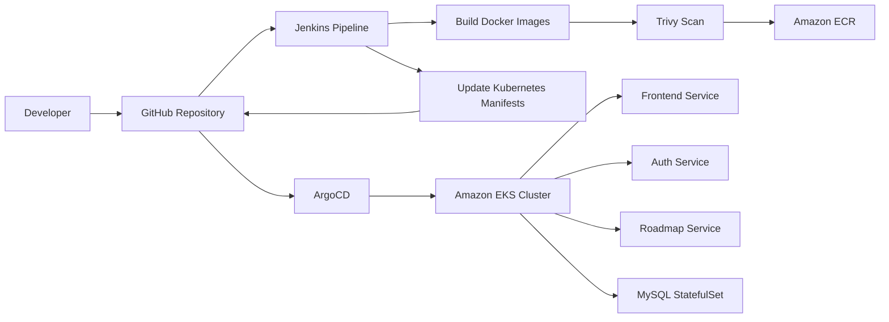

# CloudDevOpsProject

End-to-end DevOps project for a microservices-based web application, covering containerization, infrastructure provisioning, configuration management, orchestration, continuous integration, and continuous deployment.

This repository demonstrates a cloud-native workflow using Docker, Terraform, Ansible, Kubernetes, Jenkins, and ArgoCD.

---

## Table of Contents

1. [Overview](#overview)
2. [Architecture](#architecture)
3. [Repository Layout](#repository-layout)
4. [Prerequisites](#prerequisites)
5. [Local Development with Docker Compose](#local-development-with-docker-compose)
6. [Infrastructure Provisioning with Terraform](#infrastructure-provisioning-with-terraform)
7. [Configuration Management with Ansible](#configuration-management-with-ansible)
8. [Container Orchestration with Kubernetes](#container-orchestration-with-kubernetes)
9. [Continuous Integration with Jenkins](#continuous-integration-with-jenkins)
10. [Continuous Deployment with ArgoCD](#continuous-deployment-with-argocd)
11. [Troubleshooting](#troubleshooting)
12. [Screenshots / Test Results](#screenshots--test-results)

---

## Overview

This project is based on the source application from [`iVolveFinalProject`](https://github.com/Ibrahim-Adel15/iVolveFinalProject) and is organized as a complete DevOps pipeline.

The application consists of three microservices behind a frontend, with MySQL as the database:

| Service           | Technology              | Responsibility                         | Port |
| ----------------- | ----------------------- | -------------------------------------- | ---- |
| `frontend`        | Node.js / Express / EJS | Web UI and user interaction            | 3000 |
| `auth-service`    | Python / Flask          | User signup and login, database access | 5000 |
| `roadmap-service` | Java / Spring Boot      | Serves roadmap data                    | 8080 |
| `mysql`           | MySQL 8.0               | Stores application users               | 3306 |

The project includes:

* Local containerized testing with Docker Compose
* AWS infrastructure provisioning with Terraform
* Jenkins EC2 configuration with Ansible
* Kubernetes deployment manifests
* Jenkins CI pipeline for image build, scan, push, and manifest update
* ArgoCD-based deployment to Kubernetes

The assignment requirements include delivering Terraform modules, Ansible playbooks, Kubernetes YAML files, Jenkins files, ArgoCD application manifests, and documentation with setup instructions and architecture overview.

## Architecture

### Application Flow

```text
Browser
  │
  ▼
Frontend (Node.js / Express / EJS)
  │
  ├──────────────► auth-service (Flask) ─────────────► MySQL
  │
  └──────────────► roadmap-service (Spring Boot)
```

### DevOps Flow



### Infrastructure Overview

```text
Internet
  │
  ▼
AWS VPC
  ├── Public Subnet(s)
  │     └── Jenkins EC2
  │
  ├── Private Subnet(s)
  │     └── EKS Worker Nodes
  │
  ├── NAT Gateway
  ├── Internet Gateway
  └── Security Groups / Network ACLs

Amazon ECR ── stores built images
ArgoCD ── deploys Kubernetes manifests to EKS
```

---

## Repository Layout

```text
ivolve-CloudDevOpsProject/
├── docker/
│   ├── docker-compose.yaml
│   └── iVolveFinalProject/
│       ├── frontend/
│       ├── auth-service/
│       └── roadmap-service/
├── terraform/
│   ├── network/
│   ├── server/
│   ├── eks/
│   ├── ecr/
│   └── backend/
├── ansible/
│   ├── inventory/
│   ├── roles/
│   ├── group_vars/
│   └── playbooks/
├── kubernetes/
│   ├── namespace.yaml
│   ├── configmap.yaml
│   ├── secret.yaml
│   ├── frontend-deployment.yaml
│   ├── frontend-service.yaml
│   ├── auth-deployment.yaml
│   ├── auth-service.yaml
│   ├── roadmap-deployment.yaml
│   ├── roadmap-service.yaml
│   ├── mysql-statefulset.yaml
│   ├── mysql-headless-service.yaml
│   ├── storageclass.yaml
│   └── ingress.yaml
├── jenkins/
│   └── vars/
├── argocd/
│   └── application.yaml
└── README.md
```

---

## Prerequisites

Before running the project, make sure you have:

* Docker and Docker Compose
* Terraform
* AWS CLI configured with valid credentials
* kubectl
* Ansible
* Jenkins
* ArgoCD
* A GitHub repository for the project
* An AWS account with permissions for VPC, EC2, EKS, ECR, and IAM resources

---

## Local Development with Docker Compose

For local testing, all application services and the database are defined in `docker/docker-compose.yaml`.

### Run locally

```bash
cd docker
docker compose up --build
```

### What this does

1. Builds the application images from their Dockerfiles.
2. Starts MySQL first.
3. Starts `auth-service`, `roadmap-service`, and `frontend`.
4. Exposes the services locally.

### Local ports

* Frontend: `http://localhost:3000`
* Auth Service: `http://localhost:5000`
* Roadmap Service: `http://localhost:8080`
* MySQL: `localhost:3306`

### Verify the application

* Open the frontend in your browser.


](screenshots/image.png)

* Create a new user.
* Log in with the new account.
* Confirm that the roadmap page opens after login.


* Confirm that the database contains the new user record.


### Stop the stack

```bash
docker compose down -v
```


---

## Infrastructure Provisioning with Terraform

Terraform is used to provision the AWS environment required for Jenkins and Kubernetes.

The assignment requires the following Terraform modules: Network, Server, EKS, and ECR, using an S3 backend for remote state.

### Planned / implemented modules

#### 1. Network module

* VPC
* Public subnets
* Private subnets
* Internet Gateway
* NAT Gateway
* Route tables
* Network ACLs

#### 2. Server module

* Jenkins EC2 instance
* Security groups

#### 3. EKS module

* Amazon EKS cluster
* Worker nodes in private subnets
* Multiple Availability Zones
* IAM rules for the cluser and nodes

#### 4. ECR module

* ECR repositories for application images

#### 5. Backend

* S3 bucket for Terraform state


### Terraform commands

```bash
cd terraform
terraform init
terraform plan
terraform apply --auto-approve
```

### Test Results

* VPC was created successfully.
* Public and private subnets were created.
* Jenkins EC2 instance was provisioned.
* EKS cluster and worker nodes were created.
* ECR repositories were created.
* Terraform state was stored remotely in S3.


](screenshots/image-3.png)

](screenshots/image-4.png)
---

## 4. Configuration Management with Ansible

Ansible is used to automatically configure the Jenkins EC2 instance after Terraform completes provisioning. The setup is built using modular Ansible Roles, Dynamic Inventory, and Ansible Vault for encrypted credentials.

### What Ansible does

* **System & Dependencies:** Installs Java 21 (OpenJDK), aws-cli and base utilities.
* **Container Environment:** Installs Docker Engine and grants ubuntu and jenkins non-root execution permissions.
* **Security Scanner:** Installs Trivy CLI for container image scanning inside Jenkins pipelines.
* **SonarQube Code Quality Server:**

  1- Deploys SonarQube Community Edition in Docker on port 9000.

  2- Automatically updates kernel vm.max_map_count limits.

  3- Uses SonarQube REST API to change default credentials, disable forced user authentication (sonar.forceAuthentication=false), and generate a pipeline token.


* **Jenkins Automation**:

  1- Installs Jenkins on port 8080.

  2- Deploys a custom Groovy initialization script (setup-jenkins.groovy) to bypass the initial setup wizard, create the admin account, and pre-install required plugins (Docker, Git, SonarQube Scanner, Pipeline).


### Dynamic Inventory & Vault Security


* **AWS EC2 Plugin**: Automatically discovers the running EC2 instance using tags (tag:Role: Jenkins).
* **Ansible Vault**: Protects sensitive values (Jenkins admin credentials and SonarQube passwords) inside group_vars/all/vault.yml.

### How to run

* Test Dynamic Discovery:

```bash
ansible-inventory --graph
```


* Execute the Master Playbook:

```bash
ansible-playbook site.yml --ask-vault-pass
```


### Verification & Test Results

* Java 21: Installed and verified as the active runtime.
* Docker & Trivy: Installed and verified operational.
* SonarQube Web UI: Accessible at `http://<EC2_PUBLIC_IP>:9000` with automated REST API configurations applied.
* Jenkins Web UI: Accessible at `http://<EC2_PUBLIC_IP>:8080` with pre-configured admin login and pre-installed pipeline plugins.


---

## Container Orchestration with Kubernetes

Kubernetes is used to deploy the application into the EKS cluster.

The CLuster Has:

* iVolve namespace
* Deployment for each microservice
* Service for each microservice
* StatefulSet for database
* Headless service for StatefulSet
* StorageClass for persistent data
* ConfigMap and Secret for environment variables
* Ingress for the frontend

### Kubernetes resources

#### Namespace

Creates a dedicated namespace for the application.

#### Deployments

Used for:

* `frontend`
* `auth-service`
* `roadmap-service`

#### Services

Used for stable internal access between microservices.

#### StatefulSet

Used for MySQL so the database keeps stable network identity and persistent storage.

#### Headless Service

Used to expose the StatefulSet pods internally.

#### StorageClass / PVC

Used for persistent MySQL data.

#### ConfigMap and Secret

Used to inject configuration and sensitive environment variables.

#### Ingress

Used to expose the frontend externally.

### Example kubectl commands

```bash
kubectl apply -f kubernetes/namespace.yaml
kubectl apply -f kubernetes/
kubectl get pods -n ivolve
kubectl get svc -n ivolve
kubectl get ingress -n ivolve
```

### Test Results

* Namespace created successfully.
* Deployments created successfully.
* Services resolved correctly.
* MySQL StatefulSet was started with persistent storage.
* Ingress provided access to the frontend.

---

## Continuous Integration with Jenkins

Jenkins is used to automate the build and delivery process.

The assignment requires Jenkins pipelines for each microservice with these stages:

* Build Image
* Scan Image
* Push Image
* Delete Image Locally
* Update Manifests
* Push Manifests
* Use Shared Library

### Pipeline flow

```text
Checkout
  ↓
Build Image
  ↓
Scan Image
  ↓
Push Image
  ↓
Delete Local Image
  ↓
Update Manifests
  ↓
Push Manifests
```

### What the pipeline does

* Pulls source code from GitHub
* Builds Docker images for each service
* Scans images with Trivy
* Pushes images to Amazon ECR
* Updates Kubernetes manifests with the new image tags
* Pushes updated manifests back to GitHub
* Uses a Jenkins shared library to reduce repetition

### Example commands used in the pipeline

```bash
aws ecr get-login-password --region $AWS_REGION | docker login --username AWS --password-stdin $AWS_ACCOUNT_ID.dkr.ecr.$AWS_REGION.amazonaws.com
aws eks update-kubeconfig --region $AWS_REGION --name $CLUSTER_NAME --kubeconfig $WORKSPACE/kubeconfig.yaml
docker build -t $IMAGE_NAME:$BUILD_NUMBER .
trivy image $IMAGE_NAME:$BUILD_NUMBER
docker push $AWS_ACCOUNT_ID.dkr.ecr.$AWS_REGION.amazonaws.com/$IMAGE_NAME:$BUILD_NUMBER
```

### Shared Library

The `jenkins/vars/` directory contains shared pipeline logic used across microservices.

### Test Results

* Jenkins job ran successfully.
* Docker images were built successfully.
* Trivy scan completed successfully.
* Images were pushed to Amazon ECR.
* Kubernetes manifests were updated and pushed.

---

## Continuous Deployment with ArgoCD

ArgoCD is used to synchronize the Kubernetes manifests from GitHub to the EKS cluster.

The assignment requires ArgoCD to sync and deploy the app into the cluster.

### How it works

1. Jenkins updates the Kubernetes manifests in GitHub.
2. ArgoCD watches the repository.
3. ArgoCD detects changes automatically.
4. ArgoCD syncs the desired state to the EKS cluster.

### Example ArgoCD application

```yaml
apiVersion: argoproj.io/v1alpha1
kind: Application
metadata:
  name: clouddevopsproject
  namespace: argocd
spec:
  project: default
  source:
    repoURL: https://github.com/<your-username>/CloudDevOpsProject.git
    targetRevision: main
    path: kubernetes
  destination:
    server: https://kubernetes.default.svc
    namespace: ivolve
  syncPolicy:
    automated:
      prune: true
      selfHeal: true
```

### Test Results

* ArgoCD application was created successfully.
* Application synced successfully.
* Application remained in a healthy state.
* Kubernetes resources were deployed automatically from Git.

---

## Troubleshooting

### Terraform

* Make sure AWS credentials are configured.
* Make sure the S3 backend bucket exists before running `terraform init`.
* Check permissions for EC2, EKS, ECR, IAM, VPC, and S3 operations.

### Ansible

* Confirm the Jenkins EC2 instance is reachable by SSH.
* Ensure the dynamic inventory plugin is installed and configured.
* Verify that the correct private key and security group are used.

### Kubernetes

* If pods are pending, check node capacity and scheduling constraints.
* If services are not reachable, confirm labels and selectors match.
* If Ingress is not working, confirm the ingress controller is installed.

### Jenkins

* Make sure Docker is available to the Jenkins host/container.
* Check that AWS credentials are configured in Jenkins.
* Verify that ECR repositories already exist.
* Verify that the Jenkins shared library path is correct.

### ArgoCD

* Confirm the Git repository URL and branch are correct.
* Check namespace permissions.
* Verify that ArgoCD has access to the Kubernetes manifests.

---

## Screenshots / Test Results

Add screenshots here as you complete each stage of the project.

### Docker Compose

* Frontend running locally
* User registration / login
* MySQL container showing inserted data

### Terraform

* AWS console showing VPC
* AWS console showing EC2 instance
* AWS console showing EKS cluster
* AWS console showing ECR repositories

### Ansible

* Successful playbook output
* Jenkins service running on EC2

### Kubernetes

* `kubectl get pods`
* `kubectl get svc`
* `kubectl get ingress`
* Application opened in browser

### Jenkins

* Successful pipeline run
* Build / scan / push stages
* Manifest update stage

### ArgoCD

* Application status: Synced
* Application status: Healthy

---

## License

This project is for educational and training purposes.

---

## Acknowledgements

* Source application: [`iVolveFinalProject`](https://github.com/Ibrahim-Adel15/iVolveFinalProject)
* Project requirements based on the provided graduation project instructions.
