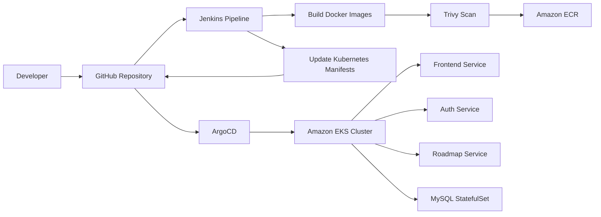
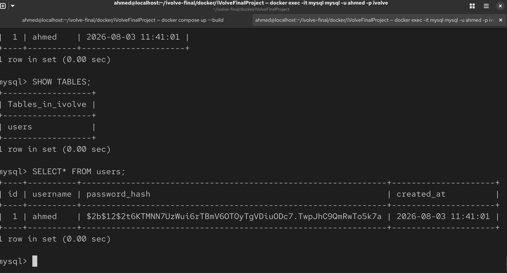
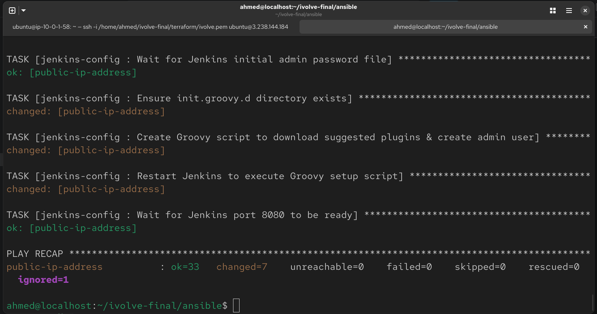
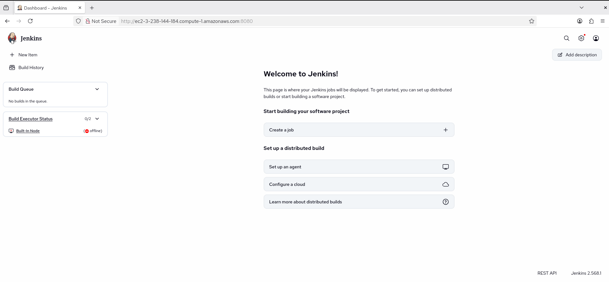
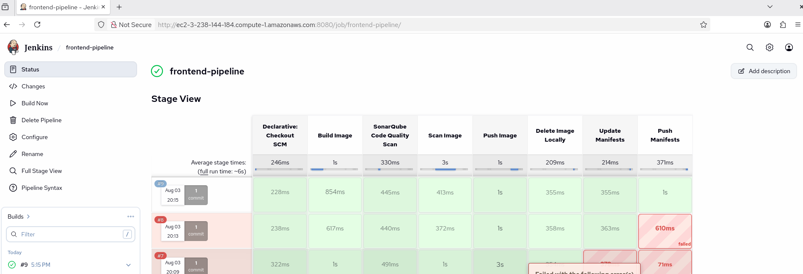
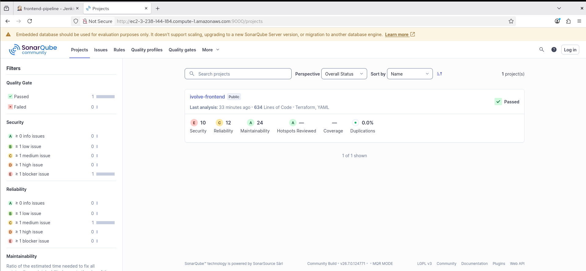
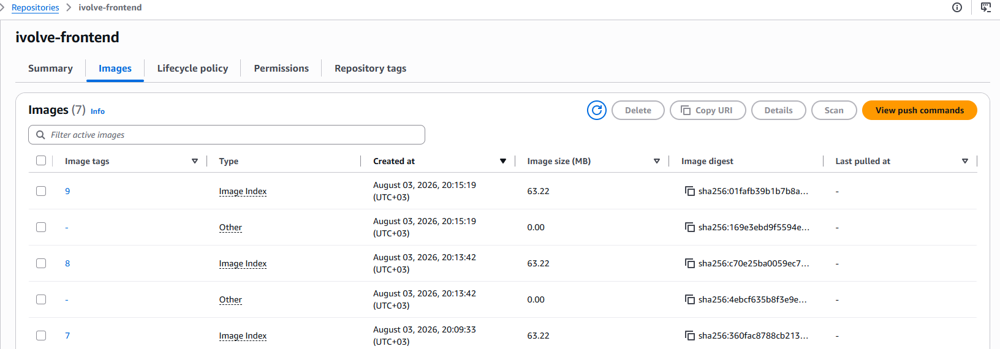
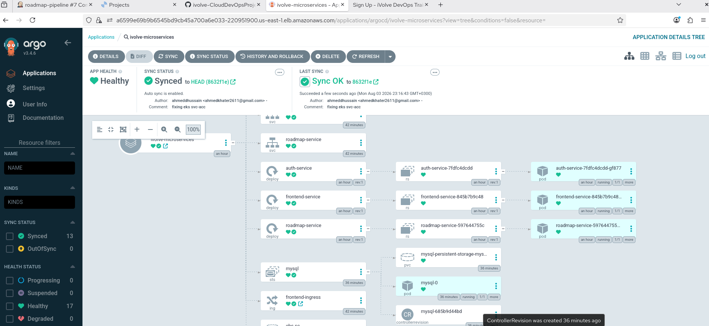
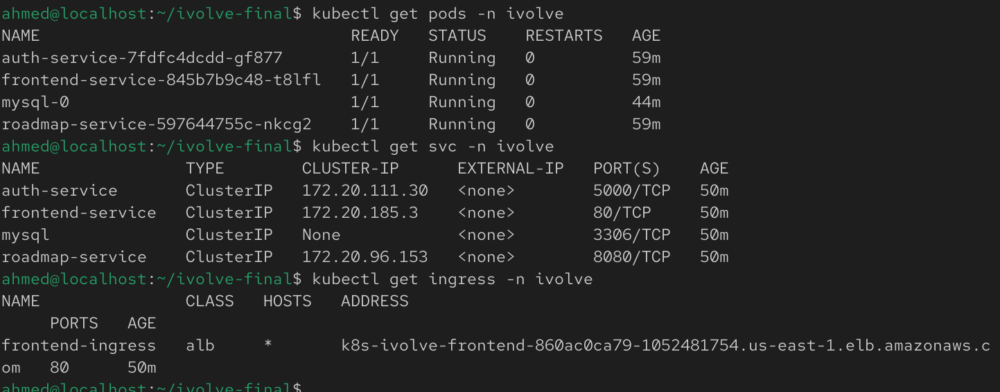
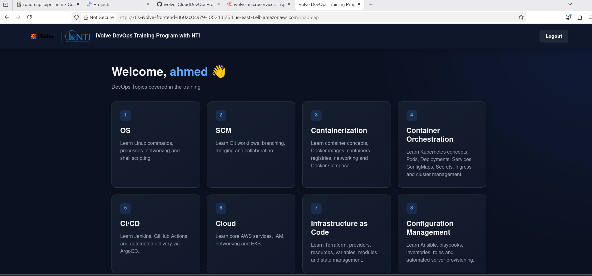

# CloudDevOpsProject

End-to-end DevOps project for a microservices-based web application, covering containerization, infrastructure provisioning, configuration management, orchestration, continuous integration, and continuous deployment.

This repository demonstrates a cloud-native workflow using Docker, Terraform, Ansible, Kubernetes, Jenkins, and ArgoCD.

---

## Table of Contents

1. [Overview](#overview)
2. [Architecture](#architecture)
3. [Repository Layout](#repository-layout)
4. [Prerequisites](#prerequisites)
5. [Local Development with Docker Compose](#local-development-with-docker-compose)
6. [Infrastructure Provisioning with Terraform](#infrastructure-provisioning-with-terraform)
7. [Configuration Management with Ansible](#configuration-management-with-ansible)
8. [Container Orchestration with Kubernetes](#container-orchestration-with-kubernetes)
9. [Continuous Integration with Jenkins](#continuous-integration-with-jenkins)
10. [Continuous Deployment with ArgoCD](#continuous-deployment-with-argocd)
11. [Troubleshooting](#troubleshooting)
12. [Screenshots / Test Results](#screenshots--test-results)

---

## Overview

This project is based on the source application from [`iVolveFinalProject`](https://github.com/Ibrahim-Adel15/iVolveFinalProject) and is organized as a complete DevOps pipeline.

The application consists of three microservices behind a frontend, with MySQL as the database:

| Service           | Technology              | Responsibility                         | Port |
| ----------------- | ----------------------- | -------------------------------------- | ---- |
| `frontend`        | Node.js / Express / EJS | Web UI and user interaction            | 3000 |
| `auth-service`    | Python / Flask          | User signup and login, database access | 5000 |
| `roadmap-service` | Java / Spring Boot      | Serves roadmap data                    | 8080 |
| `mysql`           | MySQL 8.0               | Stores application users               | 3306 |

The project includes:

* Local containerized testing with Docker Compose
* AWS infrastructure provisioning with Terraform
* Jenkins EC2 configuration with Ansible
* Kubernetes deployment manifests
* Jenkins CI pipeline for image build, scan, push, and manifest update
* ArgoCD-based deployment to Kubernetes

The assignment requirements include delivering Terraform modules, Ansible playbooks, Kubernetes YAML files, Jenkins files, ArgoCD application manifests, and documentation with setup instructions and architecture overview.

## Architecture

### Application Flow

```text
Browser
  │
  ▼
Frontend (Node.js / Express / EJS)
  │
  ├──────────────► auth-service (Flask) ─────────────► MySQL
  │
  └──────────────► roadmap-service (Spring Boot)
```

### DevOps Flow



### Infrastructure Overview

```text
Internet
  │
  ▼
AWS VPC
  ├── Public Subnet(s)
  │     └── Jenkins EC2
  │
  ├── Private Subnet(s)
  │     └── EKS Worker Nodes
  │
  ├── NAT Gateway
  ├── Internet Gateway
  └── Security Groups / Network ACLs

Amazon ECR ── stores built images
ArgoCD ── deploys Kubernetes manifests to EKS
```

---

## Repository Layout

```text
ivolve-CloudDevOpsProject/
├── docker/
│   ├── docker-compose.yaml
│   └── iVolveFinalProject/
│       ├── frontend/
│       ├── auth-service/
│       └── roadmap-service/
├── terraform/
│   ├── network/
│   ├── server/
│   ├── eks/
│   ├── ecr/
│   └── backend/
├── ansible/
│   ├── inventory/
│   ├── roles/
│   ├── group_vars/
│   └── playbooks/
├── kubernetes/
│   ├── namespace.yaml
│   ├── configmap.yaml
│   ├── secret.yaml
│   ├── frontend-deployment.yaml
│   ├── frontend-service.yaml
│   ├── auth-deployment.yaml
│   ├── auth-service.yaml
│   ├── roadmap-deployment.yaml
│   ├── roadmap-service.yaml
│   ├── mysql-statefulset.yaml
│   ├── mysql-headless-service.yaml
│   ├── storageclass.yaml
│   └── ingress.yaml
├── jenkins/
│   └── vars/
├── argocd/
│   └── application.yaml
└── README.md
```

---

## Prerequisites

Before running the project, make sure you have:

* Docker and Docker Compose
* Terraform
* AWS CLI configured with valid credentials
* kubectl
* Ansible
* Jenkins
* ArgoCD
* A GitHub repository for the project
* An AWS account with permissions for VPC, EC2, EKS, ECR, and IAM resources

---

## Local Development with Docker Compose

For local testing, all application services and the database are defined in `docker/docker-compose.yaml`.

### Run locally

```bash
cd docker
docker compose up --build
```

### What this does

1. Builds the application images from their Dockerfiles.
2. Starts MySQL first.
3. Starts `auth-service`, `roadmap-service`, and `frontend`.
4. Exposes the services locally.

### Local ports

* Frontend: `http://localhost:3000`
* Auth Service: `http://localhost:5000`
* Roadmap Service: `http://localhost:8080`
* MySQL: `localhost:3306`

### Verify the application

* Open the frontend in your browser.


](screenshots/image.png)

* Create a new user.
* Log in with the new account.
* Confirm that the roadmap page opens after login.


* Confirm that the database contains the new user record.



### Stop the stack

```bash
docker compose down -v
```


---

## Infrastructure Provisioning with Terraform

Terraform is used to provision the AWS environment required for Jenkins and Kubernetes.

The assignment requires the following Terraform modules: Network, Server, EKS, and ECR, using an S3 backend for remote state.

### Planned / implemented modules

#### 1. Network module

* VPC
* Public subnets
* Private subnets
* Internet Gateway
* NAT Gateway
* Route tables
* Network ACLs

#### 2. Server module

* Jenkins EC2 instance
* Security groups

#### 3. EKS module

* Worker nodes in private subnets
* Multiple Availability Zones
* IAM roles for the cluster and worker nodes
* IRSA (IAM Roles for Service Accounts) for the AWS Load Balancer Controller and the EBS CSI driver — avoids relying on EC2 instance metadata (IMDS) for AWS credentials, which is unreliable for pod-level AWS API access
* Installs `aws-load-balancer-controller` via Helm, with its ServiceAccount explicitly bound to its IAM role and VPC ID passed directly (no IMDS auto-discovery)
* Enables the `aws-ebs-csi-driver` EKS addon, with its own dedicated IAM role attached via `service_account_role_arn` — avoids the addon falling back to (and failing) IMDS-based credential discovery


#### 4. ECR module

* ECR repositories for application images

#### 5. Backend

* S3 bucket for Terraform state


### Terraform commands

```bash
cd terraform
terraform init
terraform plan
terraform apply --auto-approve
```

### Test Results

* VPC was created successfully.
* Public and private subnets were created.
* Jenkins EC2 instance was provisioned.
* EKS cluster and worker nodes were created.
* ECR repositories were created.
* Terraform state was stored remotely in S3.


](screenshots/image-3.png)

](screenshots/image-4.png)
---

## Configuration Management with Ansible

Ansible is used to automatically configure the Jenkins EC2 instance after Terraform completes provisioning. The setup is built using modular Ansible Roles, Dynamic Inventory, and Ansible Vault for encrypted credentials.

### What Ansible does

* **System & Dependencies:** Installs Java 21 (OpenJDK), aws-cli and base utilities.
* **Container Environment:** Installs Docker Engine and grants ubuntu and jenkins non-root execution permissions.
* **Security Scanner:** Installs Trivy CLI for container image scanning inside Jenkins pipelines.
* **SonarQube Code Quality Server:**

  1- Deploys SonarQube Community Edition in Docker on port 9000.

  2- Automatically updates kernel vm.max_map_count limits.

  3- Uses SonarQube REST API to change default credentials, disable forced user authentication (sonar.forceAuthentication=false), and generate a pipeline token.


* **Jenkins Automation**:

  1- Installs Jenkins on port 8080.

  2- Deploys a custom Groovy initialization script (setup-jenkins.groovy) to bypass the initial setup wizard, create the admin account, and pre-install required plugins (Docker, Git, SonarQube Scanner, Pipeline).


### Dynamic Inventory & Vault Security


* **AWS EC2 Plugin**: Automatically discovers the running EC2 instance using tags (tag:Role: Jenkins).
* **Ansible Vault**: Protects sensitive values (Jenkins admin credentials and SonarQube passwords) inside group_vars/all/vault.yml.

### How to run

* Test Dynamic Discovery:

```bash
ansible-inventory --graph
```


* Execute the Master Playbook:

```bash
ansible-playbook site.yml --ask-vault-pass
```


### Verification & Test Results

* Java 21: Installed and verified as the active runtime.
* Docker & Trivy: Installed and verified operational.
* SonarQube Web UI: Accessible at `http://<EC2_PUBLIC_IP>:9000` with automated REST API configurations applied.
* Jenkins Web UI: Accessible at `http://<EC2_PUBLIC_IP>:8080` with pre-configured admin login and pre-installed pipeline plugins.




---

## Container Orchestration with Kubernetes

Kubernetes is used to deploy the application into the EKS cluster.

The CLuster Has:

* iVolve namespace
* Deployment for each microservice
* Service for each microservice
* StatefulSet for database
* Headless service for StatefulSet
* StorageClass for persistent data
* ConfigMap and Secret for environment variables
* Ingress for the frontend


### Example kubectl commands

```bash
kubectl apply -f k8s/namespace.yaml
kubectl apply -f k8s/
kubectl get pods -n ivolve
kubectl get svc -n ivolve
kubectl get ingress -n ivolve
```

### Test Results

* Namespace created successfully.
* Deployments created successfully.
* Services resolved correctly.
* MySQL StatefulSet was started with persistent storage.
* Ingress provided access to the frontend.

---

##  Continuous Integration with Jenkins

Jenkins automates the Continuous Integration (CI) process for each microservice (`frontend`, `auth-service`, and `roadmap-service`). The pipelines strictly follow DevSecOps principles, incorporating code quality scans, container vulnerability analysis, ECR registry management, and GitOps manifest updates.

### Pipeline Stage Flow

```text
Checkout SCM
  ↓
Build Docker Image
  ↓
SonarQube Code Quality Scan
  ↓
Trivy Security Scan
  ↓
Push Image to AWS ECR
  ↓
Delete Image Locally (Disk Space Cleanup)
  ↓
Update Kubernetes Manifest Tag
  ↓
Push Updated Manifests to GitHub (GitOps)
```

### Key Automated Actions

- **DevSecOps Code Scanning:** Runs SonarScanner via Docker against SonarQube to analyze code quality and security vulnerabilities.
- **Microservice Builds:** Contextual Docker builds targeting `docker/iVolveFinalProject/<service-name>`.
- **Container Vulnerability Analysis:** Uses Trivy CLI to detect High and Critical severity CVEs in built images.
- **AWS ECR Push:** Authenticates securely to AWS ECR via Jenkins Credentials (AWS_ACCESS_KEY_ID & AWS_SECRET_ACCESS_KEY).
- **Disk Space Management:** Removes local build images after pushing to keep EC2 disk usage low.
- **GitOps Trigger:** Updates the image tag in `k8s/<service>-deploy-svc.yml` using sed and commits the change back to GitHub using github-credentials to trigger automatic deployment in ArgoCD.

### Shared Library Structure (vars/)

To enforce DRY (Don't Repeat Yourself) principles across all microservice pipelines, reusable Groovy pipeline steps are modularized in the vars/ folder:

- `vars/sonarscan.groovy` - Executes SonarScanner CLI via Docker container.
- `vars/buildimage.groovy` - Builds microservice Docker image with dynamic context paths.
- `vars/scanimage.groovy` - Runs Trivy vulnerability scans on local images.
- `vars/pushimage.groovy` - Logs into AWS ECR and pushes tagged images.
- `vars/deleteimagelocally.groovy` - Purges local Docker images post-push.
- `vars/updatemanifests.groovy` - Replaces image tags inside k8s/*.yml files.
- `vars/pushmanifests.groovy` - Commits and pushes modified k8s/ manifests back to GitHub.

### Pipeline Files
`Jenkinsfile.frontend` - Pipeline for Frontend microservice
`Jenkinsfile.auth` - Pipeline for Auth microservice
`Jenkinsfile.roadmap` - Pipeline for Roadmap microservice

### Notes:
- Each Jenkinsfile runs as a seperate pipeline waiting for code commit.
- dont forget to configure credentials for `github-credentials` , `aws_credentials` and `sonarqube-token` generated when runing ansible playbook.

### Test Results
- All 7 pipeline stages executed with 100% success.
- SonarQube dashboard populated at `http://<EC2_PUBLIC_IP>:9000`.
- Docker images successfully built and scanned by Trivy.
- ECR repositories populated with tag-indexed images.
- Kubernetes manifests automatically updated and pushed to GitHub.




---

## Continuous Deployment with ArgoCD

ArgoCD is deployed inside the EKS cluster to handle Continuous Deployment (CD) following the GitOps paradigm.

### GitOps Workflow

1. **Jenkins (CI)** pushes updated image tags to the `k8s/` folder in GitHub.
2. **ArgoCD (CD)** polls the GitHub repository for changes in the `k8s/` path.
3. ArgoCD automatically applies the changes to the `ivolve` namespace in EKS.
4. ArgoCD enforces **self-healing** and **pruning**, ensuring cluster state perfectly matches the Git repository.

### ArgoCD Application Specification

* **Repository:** `https://github.com/ahmeddhussain/ivolve-CloudDevOpsProject.git`
* **Path:** `k8s/`
* **Target Namespace:** `ivolve`
* **Auto Sync:** Enabled (`prune = true`, `selfHeal = true`)
### EKS Cluster Setup & Deployment Steps

1. **Connect `kubectl` to EKS Cluster:**
```bash
aws eks update-kubeconfig --region us-east-1 --name ivolve-eks-cluster
```
 OR any other way you find convient.

2. **Install ArgoCD Controller on EKS:**
```bash
kubectl create namespace argocd
kubectl apply -n argocd -f https://raw.githubusercontent.com/argoproj/argo-cd/stable/manifests/install.yaml
```
3. **Deploy ArgoCD Application Manifests:**
```bash
kubectl apply -f argocd/application.yml
kubectl apply -f argocd/svc-lb.yml

```
4. **Verify Microservices & Ingress:**
```bash
kubectl get pods -n ivolve
kubectl get svc -n ivolve
kubectl get ingress -n ivolve
```
5. **Get the first Admin password and `EXTERNAL-IP`**
```bash
kubectl -n argocd get secret argocd-initial-admin-secret -o jsonpath="{.data.password}" | base64 -d; echo
kubectl get svc argocd-server -n argocd
```

Then use the `EXTERNAL-IP` coloumn and login using `admin` and output initial password.

### Test Results

* ArgoCD successfully synced all microservices and MySQL StatefulSet.
* Frontend Ingress provisioned the AWS Application Load Balancer.



---
## System Verification & End-to-End Application Testing

This section outlines the testing procedures used to verify the platform infrastructure and validate end-to-end application functionality across all microservices and the persistent database.

---

####  Platform Infrastructure Verification

* **Terraform Provisioning:** Verified S3 backend remote state locking and resource provisioning (VPC, Subnets, EKS Cluster, ECR Repositories, EC2 Instance).
* **Ansible Configuration:** Verified zero-touch provisioning of Java 21, Docker, Trivy, SonarQube Server (Port 9000), and Jenkins (Port 8080).
* **Jenkins CI Pipelines:** Verified 100% green build execution across all 3 microservices (`frontend-pipeline`, `auth-pipeline`, `roadmap-pipeline`) covering:
  1. SonarQube Code Quality Analysis
  2. Docker Image Build
  3. Trivy Container Security Scan
  4. AWS ECR Image Push
  5. Local Docker Image Cleanup
  6. Kubernetes Manifest Image Tag Update (`k8s/*.yml`)
  7. Git Push back to GitHub
* **ArgoCD GitOps CD:** Verified automated synchronization from GitHub `k8s/` manifests to live pods in the EKS `ivolve` namespace.

---

#### End-to-End Application Functionality Testing

To validate full system functionality, traffic was tested flowing from the public Frontend interface through the backend microservices down to the persistent MySQL database.

##### Step 1: Access Frontend Web Application
Open the public Ingress Load Balancer URL in your browser:
```text
http://<AWS_LOADBALANCER_URL>
```



##### Step 2: Test Authentication Microservice (auth-service)
 - Navigate to the Sign Up / Register page on the Frontend UI.
 - Create a new test user account (Username: testuser, Password: testpassword123).
 - The Frontend sends an HTTP POST request to auth-service (Port 5000), which processes the request and writes the user record into MySQL.
 - Log in with the newly created credentials to confirm JWT token generation.

#### Step 3: Test Roadmap Microservice (roadmap-service)
- Once logged in, navigate to the Roadmaps section.
- The Frontend passes the JWT token to roadmap-service (Port 8080).
- The roadmap-service validates the JWT token, retrieves learning roadmap data, and renders it on screen.



#### Step 4: Verify Database Persistence (Proof of End-to-End Flow)
To prove that user registration traversed the full chain (Frontend ➔ Auth-Service ➔ MySQL) and persisted to disk, execute an interactive SQL check inside the mysql-0 pod in EKS:

```bash
kubectl exec -it mysql-0 -n ivolve -- mysql -u ahmed -pahmedpass ivolve
SHOW TABLES;
SELECT id, username, created_at FROM users;
```


## Real-World Troubleshooting & Solutions

This section documents real-world technical issues encountered during infrastructure setup, configuration, and pipeline execution, along with their root-cause solutions.

---

### 1 Infrastructure & Terraform

* **`InvalidKeyPair.NotFound` Error:** 
  * *Issue:* Passing a local file path (`key_name = "./ivolve.pem"`) in `terraform.tfvars` failed.
  * *Fix:* Pass only the literal key name registered in AWS Console (`key_name = "ivolve"`).

* **EC2 Disk Space Exhaustion:**
  * *Issue:* Default 8GB root volume filled up due to concurrent Docker images, Java runtimes, and SonarQube.
  * *Fix:* Expanded AWS EBS volume size to 20GB/30GB in `modules/server/main.tf` and executed `sudo growpart /dev/nvme0n1 1` and `sudo resize2fs` on Ubuntu to extend the ext4 filesystem online.


---

### 2 Ansible & Server Configuration


* **SonarQube Admin Password Policy (HTTP 400):**
  * *Issue:* REST API password change task failed because SonarQube enforces a strict 12-character minimum password policy.
  * *Fix:* Updated `vault_sonarqube_admin_password` in `vault.yml` to a 12+ character string (`StrongPassword123!`).

* **Jenkins Startup Failure (`Java 17 older than required Java 21`):**
  * *Issue:* Jenkins service failed on boot because recent Jenkins releases require Java 21+.
  * *Fix:* Updated `vars.yml` and `roles/common/tasks/main.yml` to install `openjdk-21-jdk`.


---

### 3 Jenkins CI & Shared Libraries


* **Docker Build Context (`path not found`):**
  * *Issue:* `docker build` failed because microservices are located in subdirectories (`docker/iVolveFinalProject/frontend`) that are cloned by another repoisitry.
  * *Fix:* Updated `Jenkinsfile`s to pass relative directory paths to `buildimage(name, tag, "docker/iVolveFinalProject/frontend")` and merged the source code repoisitry.

* **SonarScanner Memory Freeze:**
  * *Issue:* SonarQube JS sensor froze while attempting to analyze binary `.png` images and `node_modules`.
  * *Fix:* Updated `vars/sonarscan.groovy` to run `sonarsource/sonar-scanner-cli` inside Docker with memory caps (`-Dsonar.javascript.node.maxspace=512`) and exclusions (`-Dsonar.exclusions=**/node_modules/**,**/*.png,**/*.jpg`).


---

### 4. Kubernetes & ArgoCD GitOps

* **PVC Stuck in `Pending` (EBS CSI Driver Auth Failure):**
  * *Issue:* The `mysql-persistent-storage-mysql-0` PVC stayed `Pending` indefinitely. The EBS CSI controller pods were in `CrashLoopBackOff`, logging `no EC2 IMDS role found` — the driver had no way to authenticate to AWS since it relied on EC2 instance metadata (IMDS), which isn't a reliable credential source for pod-level AWS API access on EKS.
  * *Fix:* Created a dedicated IAM role for the EBS CSI driver's ServiceAccount via IRSA (IAM Roles for Service Accounts), with the `AmazonEBSCSIDriverPolicy` attached, and bound it via `service_account_role_arn` on the `aws_eks_addon.ebs_csi` Terraform resource. Once the ServiceAccount had a real IAM identity, the controller pods came up healthy and the PVC bound automatically.

* **Ingress ALB Address Pending (Load Balancer Controller Not Installed):**
  * *Issue:* The Ingress showed no `ADDRESS` because the AWS Load Balancer Controller — required to provision an ALB from an `ingressClassName: alb` Ingress — wasn't installed in the cluster at all.
  * *Fix:* Installed the AWS Load Balancer Controller via Helm, with its own dedicated IRSA role (`AWSLoadBalancerControllerIAMPolicy` attached) so it could call the EC2/ELB APIs needed to provision the ALB.

* **AWS Load Balancer Controller CrashLoopBackOff (IMDS Timeout):**
  * *Issue:* Even after installing the controller, pods failed with `failed to get VPC ID from instance metadata` and later `failed to introspect region from EC2Metadata` — both from the same underlying cause as the EBS CSI driver: reliance on IMDS auto-discovery, which timed out.
  * *Fix:* Passed `vpcId` and `region` explicitly to the Helm release instead of relying on IMDS auto-discovery, and bound the controller's ServiceAccount to its IRSA role via `serviceAccount.annotations."eks.amazonaws.com/role-arn"`.


---


## License

This project is for educational and training purposes.

---


